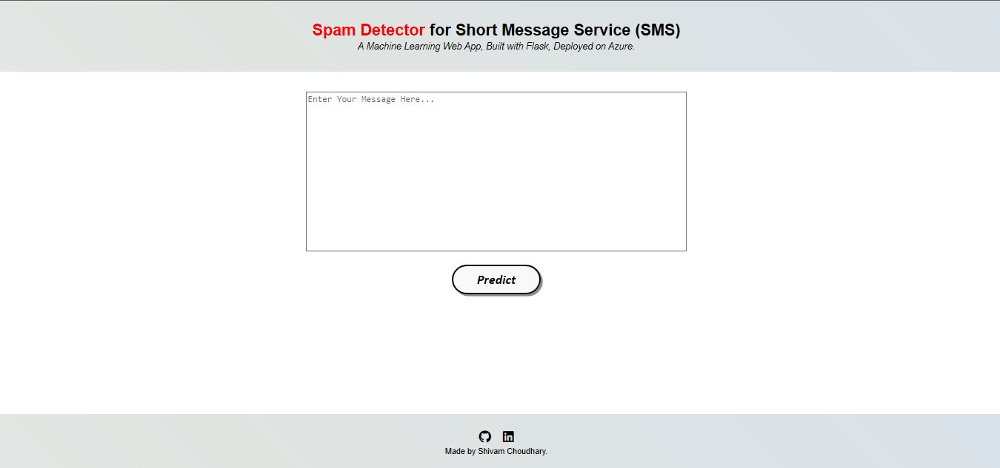

# Spam SMS Classification - Deployment
  

• This repository consists of files required to deploy a ___Machine Learning Web App___ created with ___Flask___ on ___Azure___ platform.

• If you want to view the deployed model, click on the following link: 
Deployed at: _https://spamsms.azurewebsites.net/_

• If you are searching for Code, Algorithms used and Accuracy of the model.. you won't find it here. Click the link mentioned below for the same: 
Link: _https://github.com/Shivam2017/NLP-Project/tree/master/SMS_

• Please do ⭐ the repository, if it helped you in anyway.

• A glimpse of the web app:

